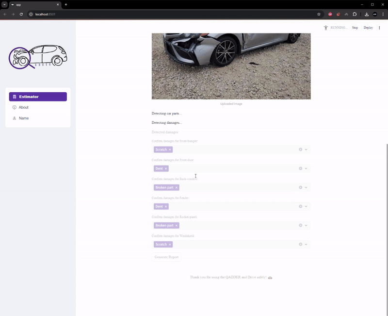

# car-damage-estimator
This Project are a part of Building and Developing AI Models Bootcamp Requirements, Tuwaiq Academy.

Team members :
- Rayan Alzamil
- Khulud Alsulami
- Roqaih Aldarjan
- Marwah Thari

# Introduction
This project aims to reduce time and human effort by automating the process of vehicle damage inspection resulting from accidents using Deep Learning and Computer Vision Techniques. The system is designed to identify the various parts of the vehicle and detect any damaged components. After identifying the damages, the system generates a report listing the affected parts.

This solution not only improves efficiency but also enhances accuracy in damage assessment, offering a faster and more reliable way to inspect vehicles after accidents.

## Dataset Overview
For the datasets in this project, we have used two datasets: Car Parts and Car Damages Datasets. One is for car parts, and the other is for car damage in combination with the CarDD dataset.

### Datasets Sizes:
- [CarDD](https://cardd-ustc.github.io/): 4000 images
- [CPACD](https://humansintheloop.org/resources/datasets/car-parts-and-car-damages-dataset/): 814 images
- [CPACD](https://humansintheloop.org/resources/datasets/car-parts-and-car-damages-dataset/): 998 images

## Methodology

### a. Part and Damage Detection:
Two [Detectron2](https://github.com/facebookresearch/detectron2/blob/main/MODEL_ZOO.md) Zoo models were used in the project by applying Transfer Learning techniques, due to unsatisfactory results from models trained from scratch.

### b. Combining the Two Models' Results:
We calculated the overlapping between the segments from the Parts Detection model and the Damage Detection model, and returned every part with the overlapping damages based on a certain IoU (Intersection over Union).


## Inference
Uploading Image & Specifying Car Information :


Double check the model output :


Generate basic report :


Download PDF Report :


**More Information in** ```qadder_report.pdf```
